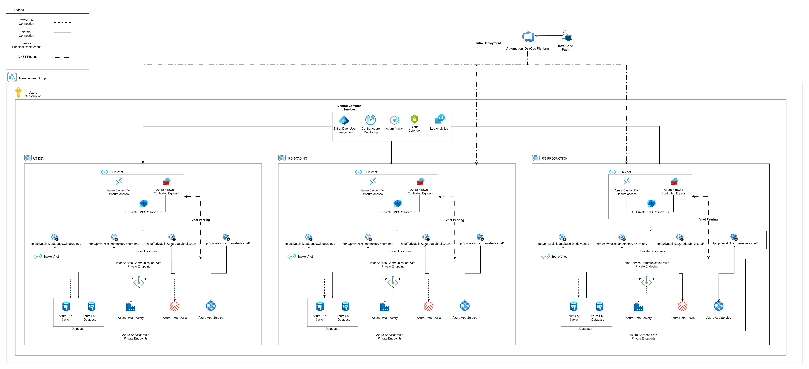

# Task 1.1 -- Architecture Design

## Architecture Diagram

## Hub-Spoke Network Topology

The workload uses a Hub-Spoke model. The Hub VNet holds shared services (Azure Bastion, Azure Firewall, Private DNS Zones). The Spoke VNet holds the application workload (App Service, SQL, Data Factory, Databricks). The two VNets are connected by bidirectional peering.

All PaaS services are accessed through Private Endpoints. No service has a public endpoint. DNS resolution for private endpoints is handled by centralized Private DNS Zones in the Hub, linked to both VNets.

## VNet and Subnet Design

The Hub and Spoke each use a /16 address space. Each environment (DEV, STG, PROD) gets its own non-overlapping address range so the environments can be peered or migrated to separate subscriptions later.

**Hub subnets:**
- AzureBastionSubnet (/26) -- required name for Azure Bastion
- AzureFirewallSubnet (/26) -- required name for Azure Firewall

**Spoke subnets:**
- App Service integration subnet (/24)
- Private Endpoints subnet (/24) -- hosts all PE NICs
- Databricks host subnet (/24)
- Databricks container subnet (/24)

## How Each Service Connects Privately

**App Service** is VNet-integrated into the spoke subnet for outbound traffic. Inbound traffic goes through its Private Endpoint. Public access is disabled.

**Azure SQL** is only accessible through its Private Endpoint in the spoke. SQL authentication is completely disabled; only Entra ID (Azure AD) authentication is allowed.

**Azure Data Factory** uses a Managed Virtual Network with a Managed Integration Runtime. It connects to other services through Private Endpoints. Public access is disabled.

**Azure Databricks** is deployed with VNet injection and No Public IP (NPIP) mode. Clusters only get private IPs. Its workspace is accessible through a Private Endpoint.

## Private DNS Zones

Four Private DNS Zones are deployed in the Hub and linked to both VNets:

| Zone | Service |
|------|---------|
| privatelink.azurewebsites.net | App Service |
| privatelink.database.windows.net | Azure SQL |
| privatelink.datafactory.azure.net | Data Factory |
| privatelink.azuredatabricks.net | Databricks |

Each Private Endpoint has a DNS zone group that auto-registers its A-record in the correct zone. This means clients in either VNet resolve the service FQDN to the private IP automatically.

## Authentication Between Services

Every service uses a System Assigned Managed Identity. There are no passwords, connection strings, or secrets stored anywhere in the code.

- App Service authenticates to SQL using its Managed Identity token
- Data Factory authenticates to SQL and other sources using its Managed Identity
- SQL Server is configured with Entra-only authentication (SQL auth is disabled entirely)
- Databricks uses its workspace-level managed identity

RBAC roles are assigned to the Managed Identities so each service has the minimum permissions it needs. For example, App Service gets SQL DB Contributor scoped to the resource group, and Data Factory gets both Data Factory Contributor and SQL DB Contributor.

## Subscription Limitations and Design Trade-offs

This workload was built and deployed under a single Azure subscription with limited quotas. Several design decisions reflect these constraints rather than best-practice enterprise patterns. The architecture is structured so that each trade-off can be upgraded independently when subscription or budget constraints are removed.

### Single Subscription, Resource Group Separation

All three environments (DEV, STG, PROD) run in the same subscription, separated by resource groups (`rg-secure-workload-dev`, `rg-secure-workload-stg`, `rg-secure-workload-prod`). In an enterprise design, each environment would have its own subscription under a Management Group hierarchy. This gives better blast radius isolation, independent quota pools, separate billing, and cleaner RBAC boundaries.

### SKU Constraints

PROD and STG both use S1-tier App Service Plans and S1-tier SQL databases. DEV uses B1/Basic. These are not production-grade SKUs. The original design targeted P1v3 for App Service and P2 for SQL in PROD, but the subscription hit `SubscriptionIsOverQuotaForSku` errors for PremiumV3 VMs. In an enterprise setting, PROD would use Premium-tier SKUs for SLA guarantees, autoscale, and staging slots.

### Zone Redundancy Disabled

SQL databases have `zoneRedundant: false` and `requestedBackupStorageRedundancy: 'Local'` across all environments. The S1 SKU does not support zone-redundant deployments. In an enterprise design with Premium/Business Critical SKUs, zone redundancy and geo-redundant backups would be enabled for PROD to survive datacenter-level failures.

### Single Region

All environments deploy to westus3. There is no multi-region failover, no Traffic Manager or Front Door, and no geo-replicated SQL. In an enterprise design, PROD would deploy to a primary and secondary region (e.g., westus3 + eastus2) with active-passive or active-active failover.

### RBAC Deployment

The pipeline service principal has Contributor and User Access Administrator roles scoped to each environment's Resource Group. This allows the pipeline to deploy RBAC role assignments for Managed Identities (App Service → SQL DB Contributor, Data Factory → SQL DB Contributor, Data Factory → Data Factory Contributor). The `deployRbac` flag is set to `true` in all parameter files. In an enterprise setup, role assignments would target individual resources rather than the Resource Group, and Entra ID Groups would be used instead of individual identities for easier auditing.

### Policies at Resource Group Scope

Azure Policy assignments are scoped to the resource group rather than the Management Group or subscription. This means they only protect resources within that specific RG. In an enterprise design, deny policies for public access would be assigned at the Management Group level so they cascade to all subscriptions and resource groups automatically.

### What Would Change in an Enterprise Design

| Area | Current (Subscription-Limited) | Enterprise Target |
|------|-------------------------------|-------------------|
| Environment isolation | Resource groups in one subscription | Separate subscription per environment |
| App Service SKU (PROD) | S1 | P1v3 or P2v3 with autoscale |
| SQL SKU (PROD) | S1 | P2 or Business Critical with zone redundancy |
| SQL backup redundancy | Local | Geo-redundant |
| Region strategy | Single region (westus3) | Multi-region with failover |
| RBAC deployment | Enabled (UAA scoped to each RG) | UAA at Management Group scope with resource-level assignments |
| Policy scope | Resource Group | Management Group |
| Monitoring | Log Analytics workspace + diagnostic settings on all resources (gated by deployMonitoring flag). Defender for Cloud data collection rule routes security events to workspace. | Full Azure Monitor with Application Insights APM, alerting rules, and dashboards |
| Secret management | Managed Identities only | Azure Key Vault for certificates and rotation |
| DDoS protection | None | DDoS Protection Standard on Hub VNet |
| WAF | None | Azure Front Door or Application Gateway with WAF |
